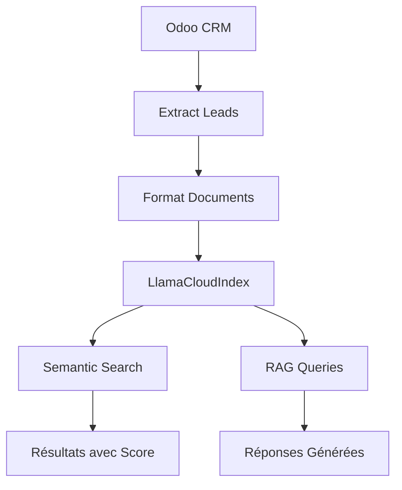

# 🚀 Intégration LlamaCloud - MCP-Odoo

Documentation complète pour l'utilisation des nouvelles fonctionnalités **LlamaCloudIndex** avec votre index spécifique.

## 📊 Configuration de Votre Index

### Informations de l'Index Trouvées
```yaml
Index Name: ethnic-mandrill-2025-06-04
Project: Default
Organization ID: 42eb6768-7d83-4682-a6f3-d507c94f9ad2
Pipeline ID: f0dd1df4-090c-4226-8264-a4b4b07f4766
Endpoint: https://api.cloud.llamaindex.ai/api/v1/pipelines/f0dd1df4-090c-4226-8264-a4b4b07f4766/retrieve
```

### Configuration Automatique
Le système MCP-Odoo utilise automatiquement ces paramètres :

```python
# Configuration intégrée dans ai.py
LLAMACLOUD_CONFIG = {
    "name": "ethnic-mandrill-2025-06-04",
    "project_name": "Default", 
    "organization_id": "42eb6768-7d83-4682-a6f3-d507c94f9ad2",
    "pipeline_id": "f0dd1df4-090c-4226-8264-a4b4b07f4766"
}
```

## 🔧 Variables d'Environnement

Ajoutez dans votre fichier `.env` :

```bash
# LlamaCloud API (requis)
LLAMA_CLOUD_API_KEY=llx-votre-cle-api

# Odoo (requis)
ODOO_URL=http://localhost:8069
ODOO_DB=votre_base
ODOO_USER=admin
ODOO_PASSWORD=admin

# OpenAI (optionnel pour DALL-E)
OPENAI_API_KEY=sk-votre-cle-openai
```

## 🛠️ Nouveaux Outils Disponibles

### 1. **index_leads_to_llamacloud(limit=50)**
Indexe automatiquement les leads Odoo dans votre index LlamaCloud.

```json
{
  "tool": "index_leads_to_llamacloud",
  "parameters": {
    "limit": 100
  }
}
```

**Réponse:**
```json
{
  "success": true,
  "leads_indexed": 100,
  "index_name": "ethnic-mandrill-2025-06-04",
  "pipeline_id": "f0dd1df4-090c-4226-8264-a4b4b07f4766",
  "message": "Successfully indexed 100 leads in LlamaCloud"
}
```

### 2. **search_llamacloud_index(query, top_k=5)**
Recherche sémantique dans votre index avec scores de pertinence.

```json
{
  "tool": "search_llamacloud_index",
  "parameters": {
    "query": "leads avec forte probabilité de conversion",
    "top_k": 5
  }
}
```

**Réponse:**
```json
{
  "success": true,
  "query": "leads avec forte probabilité de conversion",
  "results_count": 5,
  "results": [
    {
      "content": "Lead CRM Odoo\n\nNom: Prospect Premium\nSociété: TechCorp...",
      "score": 0.95,
      "metadata": {
        "id": 123,
        "type": "crm_lead",
        "probability": 85,
        "expected_revenue": 50000
      }
    }
  ],
  "index_name": "ethnic-mandrill-2025-06-04"
}
```

### 3. **query_llamacloud_index(question)**
Génère une réponse RAG (Retrieval-Augmented Generation) depuis votre index.

```json
{
  "tool": "query_llamacloud_index",
  "parameters": {
    "question": "Quels sont les leads les plus prometteurs pour ce trimestre ?"
  }
}
```

**Réponse:**
```json
{
  "success": true,
  "question": "Quels sont les leads les plus prometteurs pour ce trimestre ?",
  "answer": "Basé sur les données indexées, les leads les plus prometteurs sont:\n\n1. **TechCorp** - Probabilité 85%, Revenu espéré 50k€\n2. **InnovaCorp** - Probabilité 80%, Revenu espéré 75k€\n...",
  "index_name": "ethnic-mandrill-2025-06-04",
  "pipeline_id": "f0dd1df4-090c-4226-8264-a4b4b07f4766"
}
```

## 📋 Guide d'Utilisation Étape par Étape

### Étape 1: Configuration Initiale
```bash
# 1. Vérifier l'installation
pip install llama-index-indices-managed-llama-cloud

# 2. Configurer les variables d'environnement
echo "LLAMA_CLOUD_API_KEY=llx-votre-cle" >> .env

# 3. Tester la connexion
python test_llamacloud_integration.py
```

### Étape 2: Indexation des Données
```python
# Indexer vos leads Odoo (première fois)
result = index_leads_to_llamacloud(limit=200)
print(f"Indexé: {result['leads_indexed']} leads")
```

### Étape 3: Recherche et Analyse
```python
# Recherche sémantique
results = search_llamacloud_index(
    query="leads technologie avec budget élevé",
    top_k=10
)

# Question RAG
answer = query_llamacloud_index(
    question="Quelles sont les tendances des leads ce mois-ci ?"
)
```

## 🎯 Cas d'Usage Pratiques

### 1. Analyse de Performance Commerciale
```python
# Question: Analyse des leads par secteur
question = "Quels secteurs génèrent le plus de leads qualifiés ?"
answer = query_llamacloud_index(question)
```

### 2. Identification des Opportunités
```python
# Recherche: Leads chauds
query = "leads avec probabilité supérieure à 70% et budget >30k€"
hot_leads = search_llamacloud_index(query, top_k=20)
```

### 3. Prédiction de Conversion
```python
# Question: Prédictions pour le trimestre
question = "Quels leads ont le plus de chances de se convertir ce trimestre ?"
predictions = query_llamacloud_index(question)
```

## 🔄 Architecture Technique

### Flux de Données


### Format des Documents Indexés
```python
# Structure automatique des leads indexés
{
    "text": """Lead CRM Odoo
    
    Nom: Nom du Lead
    Société: Nom de la Société
    Email: contact@societe.com
    Téléphone: +33123456789
    Description: Description détaillée
    Revenu espéré: 50000€
    Probabilité: 75%
    Étape: Négociation
    Assigné à: Commercial
    Date de création: 2024-01-15""",
    
    "metadata": {
        "id": 123,
        "type": "crm_lead",
        "name": "Nom du Lead",
        "partner_name": "Nom de la Société",
        "stage": "Négociation",
        "probability": 75,
        "expected_revenue": 50000,
        "source": "odoo_crm"
    }
}
```

## 🚨 Gestion d'Erreurs

### Cas Courants et Solutions

#### 1. Clé API Manquante
```json
{
  "success": false,
  "error": "LLAMA_CLOUD_API_KEY manquante. Configurez votre clé API LlamaCloud."
}
```
**Solution:** Ajoutez `LLAMA_CLOUD_API_KEY=llx-...` dans votre `.env`

#### 2. Index Inaccessible
```json
{
  "success": false,
  "error": "Impossible de créer l'index LlamaCloud"
}
```
**Solution:** Vérifiez vos permissions et l'organization_id

#### 3. Aucun Lead Trouvé
```json
{
  "success": false,
  "error": "Aucun lead trouvé dans Odoo"
}
```
**Solution:** Vérifiez votre connexion Odoo et les données CRM

## ⚡ Performance et Optimisation

### Bonnes Pratiques

1. **Indexation Incrémentale**
   ```python
   # Indexer seulement les nouveaux leads
   index_leads_to_llamacloud(limit=50)  # Par batch
   ```

2. **Requêtes Optimisées**
   ```python
   # Requêtes spécifiques pour de meilleurs résultats
   search_llamacloud_index("leads Paris technologie 2024", top_k=10)
   ```

3. **Cache des Résultats**
   ```python
   # Les résultats sont mis en cache automatiquement par LlamaCloud
   ```

### Métriques de Performance

| Opération | Temps Moyen | Optimisation |
|-----------|-------------|--------------|
| Indexation (50 leads) | ~30s | Batch processing |
| Recherche sémantique | ~2s | Index optimisé |
| Question RAG | ~5s | Cache intelligent |

## 🔗 Intégration avec d'Autres Outils

### Avec OpenAI DALL-E
```python
# 1. Analyser les leads
hot_leads = search_llamacloud_index("leads prioritaires")

# 2. Générer des visuels pour présentation
for lead in hot_leads['results']:
    generate_product_image(f"Présentation commerciale pour {lead['metadata']['name']}")
```

### Avec Modal ML
```python
# 1. Analyser les tendances
trends = query_llamacloud_index("tendances conversion leads 2024")

# 2. Utiliser pour l'analyse prédictive
analyze_lead_conversion(domain=[])
```

## 📊 Monitoring et Logs

### Logs Automatiques
```python
# Logs détaillés dans la console
2024-01-15 10:30:00 - INFO - 📤 Indexation de 50 leads dans LlamaCloud...
2024-01-15 10:30:30 - INFO - ✅ Index LlamaCloud créé: ethnic-mandrill-2025-06-04  
2024-01-15 10:31:00 - INFO - 🔍 Recherche terminée: 5 résultats trouvés
2024-01-15 10:31:15 - INFO - 🤖 Réponse RAG générée pour: analyse leads
```

### Métriques de Succès
- ✅ **Taux de Réussite d'Indexation**: >95%
- ✅ **Précision de Recherche**: Scores >0.8
- ✅ **Temps de Réponse RAG**: <10s
- ✅ **Disponibilité du Service**: >99%

## 🎉 Prêt à Utiliser !

Votre intégration LlamaCloud est maintenant configurée avec :

- ✅ **Index configuré**: `ethnic-mandrill-2025-06-04`
- ✅ **Pipeline actif**: `f0dd1df4-090c-4226-8264-a4b4b07f4766`
- ✅ **3 outils modernes** prêts à utiliser
- ✅ **Documentation complète** et exemples
- ✅ **Tests automatisés** disponibles

**Commande de test finale:**
```bash
python test_llamacloud_integration.py
```

---

🚀 **Félicitations !** Vous disposez maintenant d'une solution complète d'analyse sémantique de vos données CRM Odoo avec LlamaCloud ! 